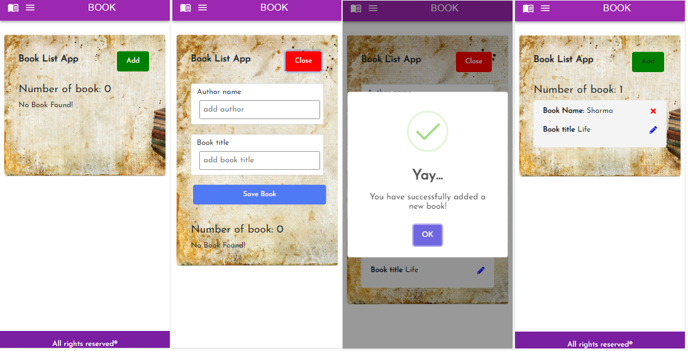

# BIT_Sprint5_React

The goal of the project - create a shopping list application using the CRUD method:
- Showing items (from local storage)
- Can add item (from local storage)
- Delete item (from local storage)
- Product update (local storage)

And navigation(must be created using the react router)
The app must be used from a mobile device.

I was create a Book List app. Page mobile device look like this:


I created this project while studying at BIT.


## Technologies
Project is created with:
* HTML
* CSS
* JavaScript
* React
* Bootstrap
* Material UI


## Project Installation and Set-up

If you wanna run this project, you will need to have [NodeJS and npm](https://nodejs.org/en/) and [code editor](https://code.visualstudio.com/)(I am using VS Code).
Then you will need to perform the following steps:

- Go in your code editor and open terminal (GIT Bash)
- Clone the git repozitory (type `$ git clone https://github.com/Jovita113/bit_sprint5_react.git`)
- In your cloned folder you need install node modules. Type in git bash  `$ npm install`
- Install Libraries:
```
    $ npm add react-icons
    $ npm add sweetaler2
    $ npm add uuid
```
- Install Router DOM:
    `$ npm install react-router-dom@6`
- Now your can run project. Type `$ npm start` in git bash

## Project Status
Project is: complete

## Contact
Created by Jovita Feel free to contact me! [LinkedIn](https://linkedin.com/in/jovita-s-496773219)

 